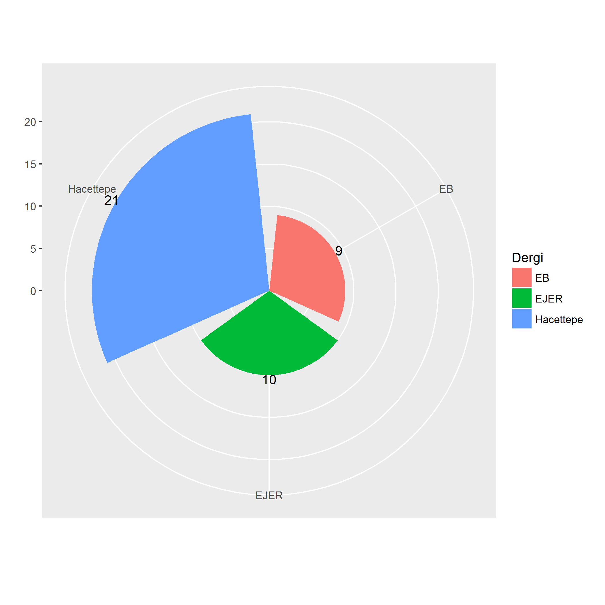
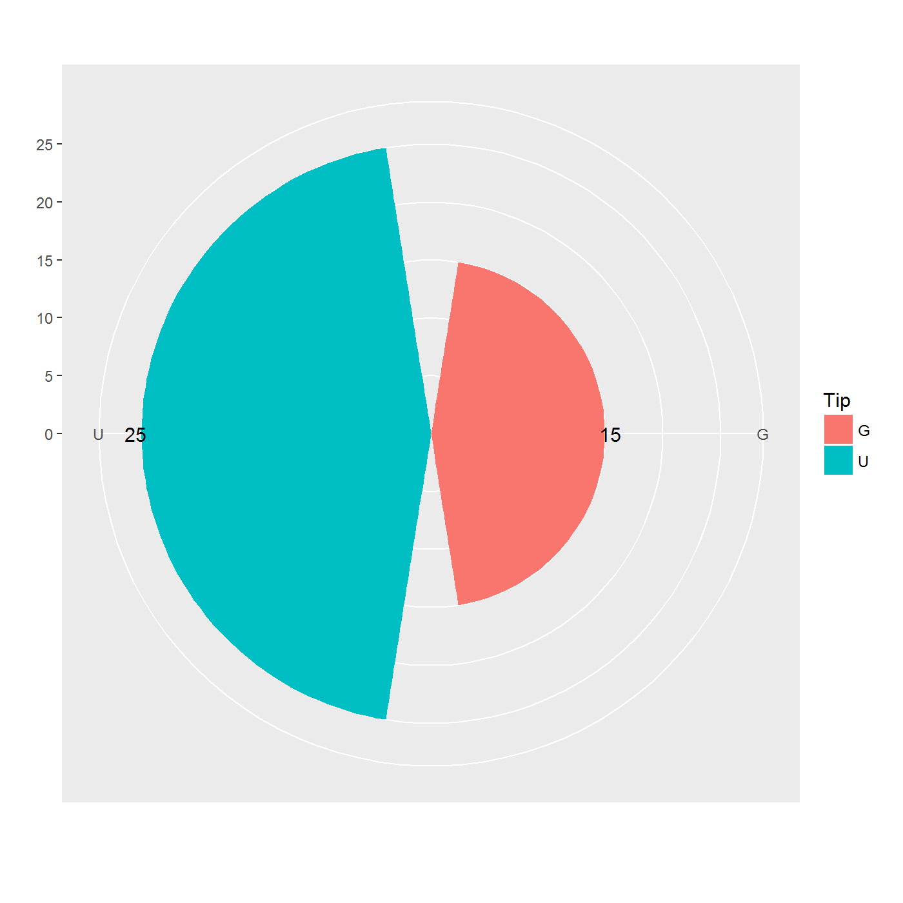
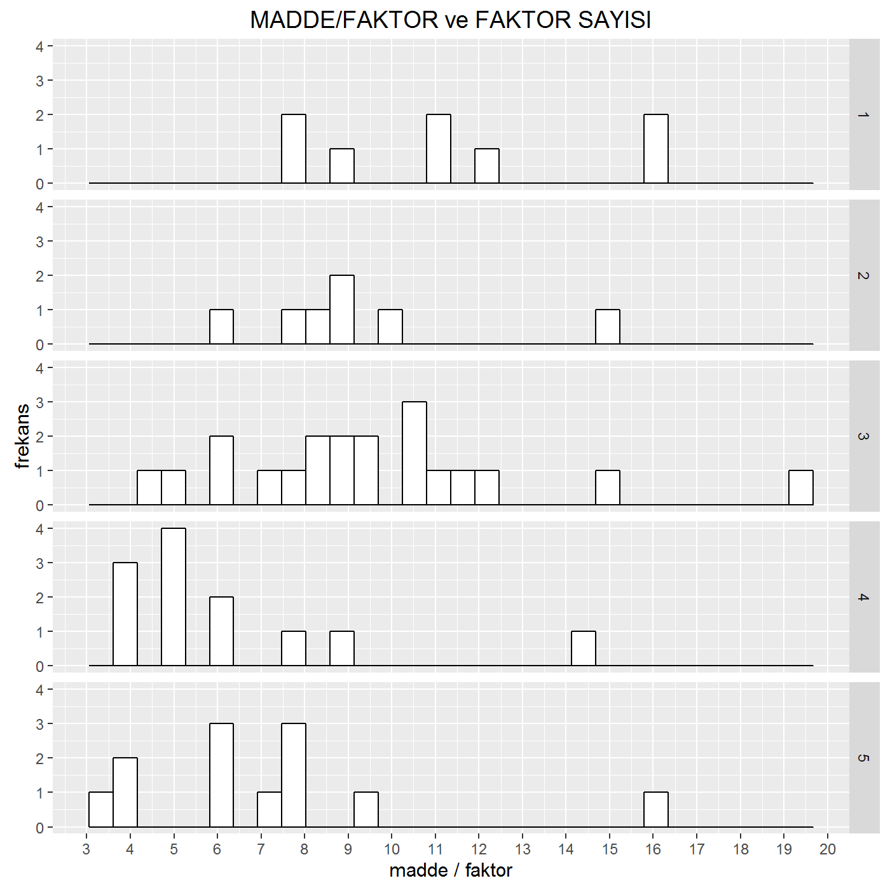
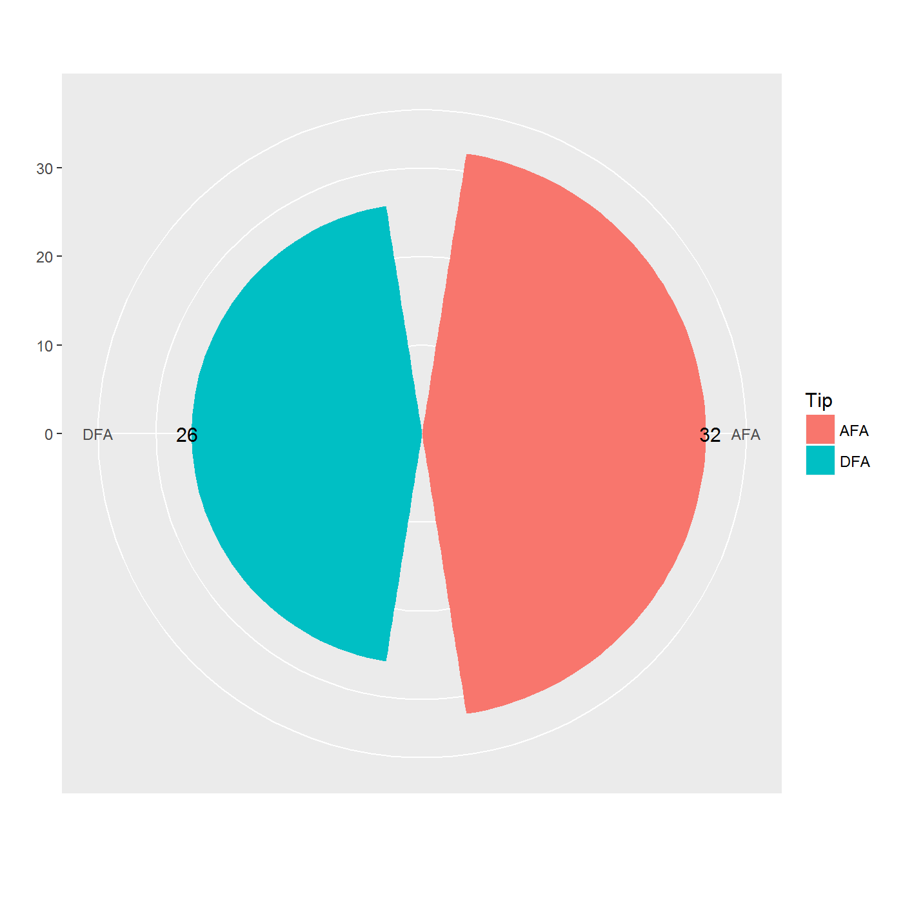
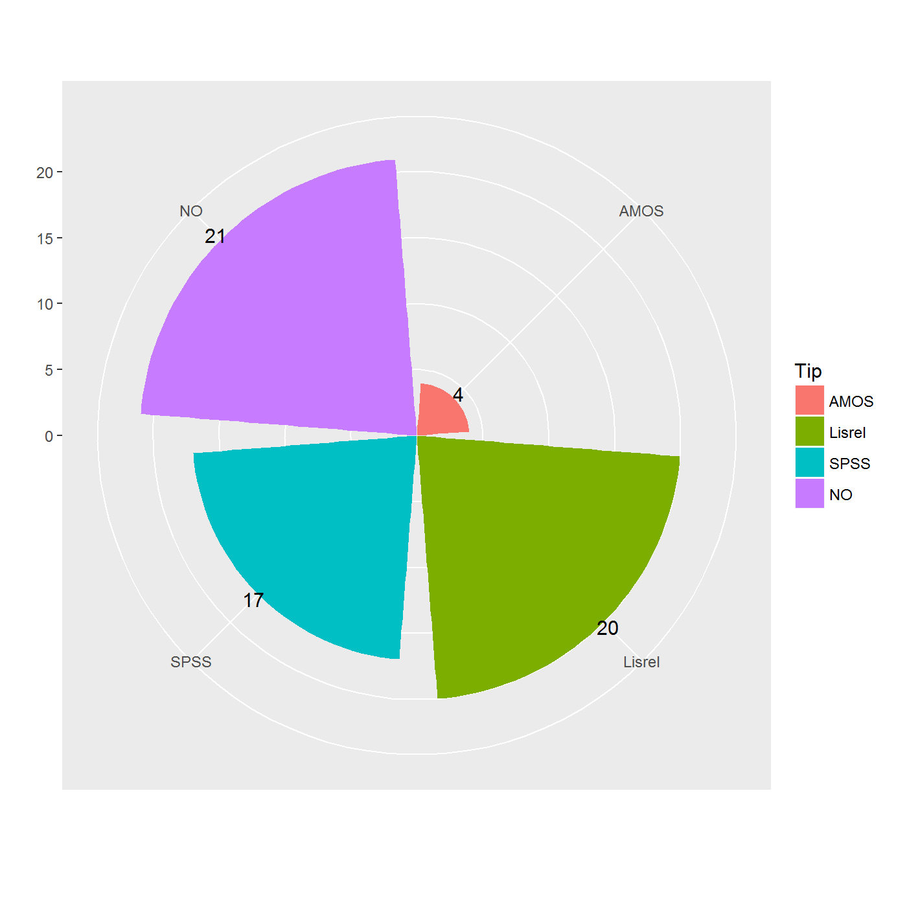
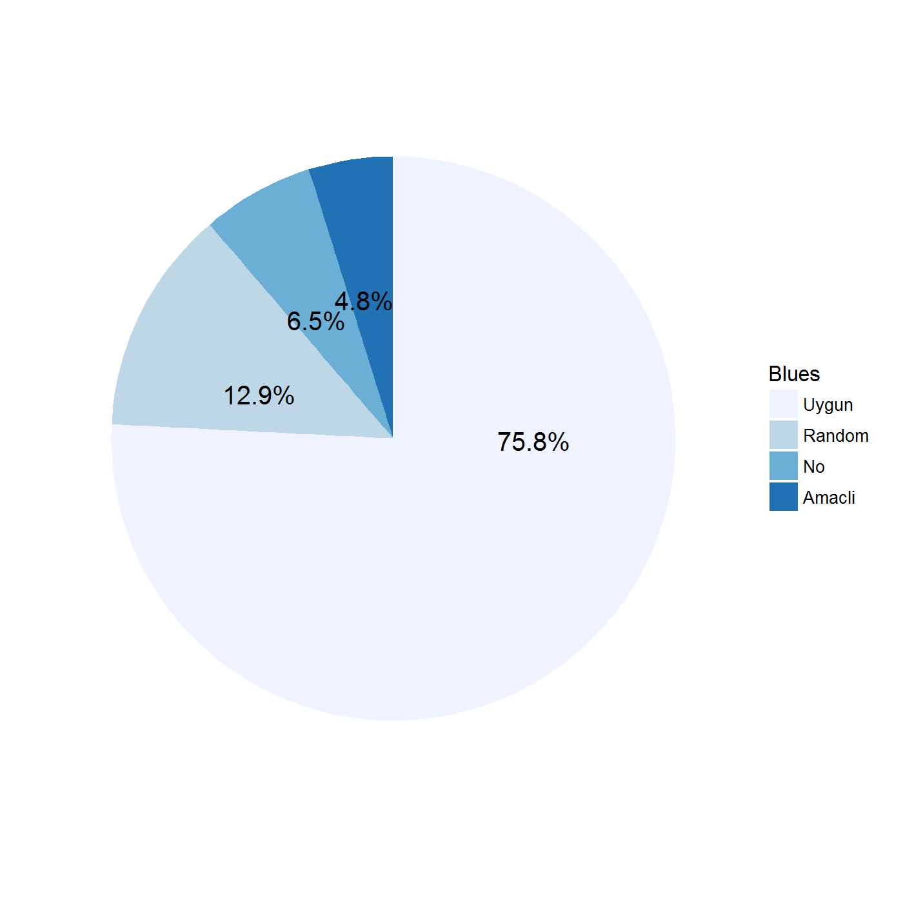
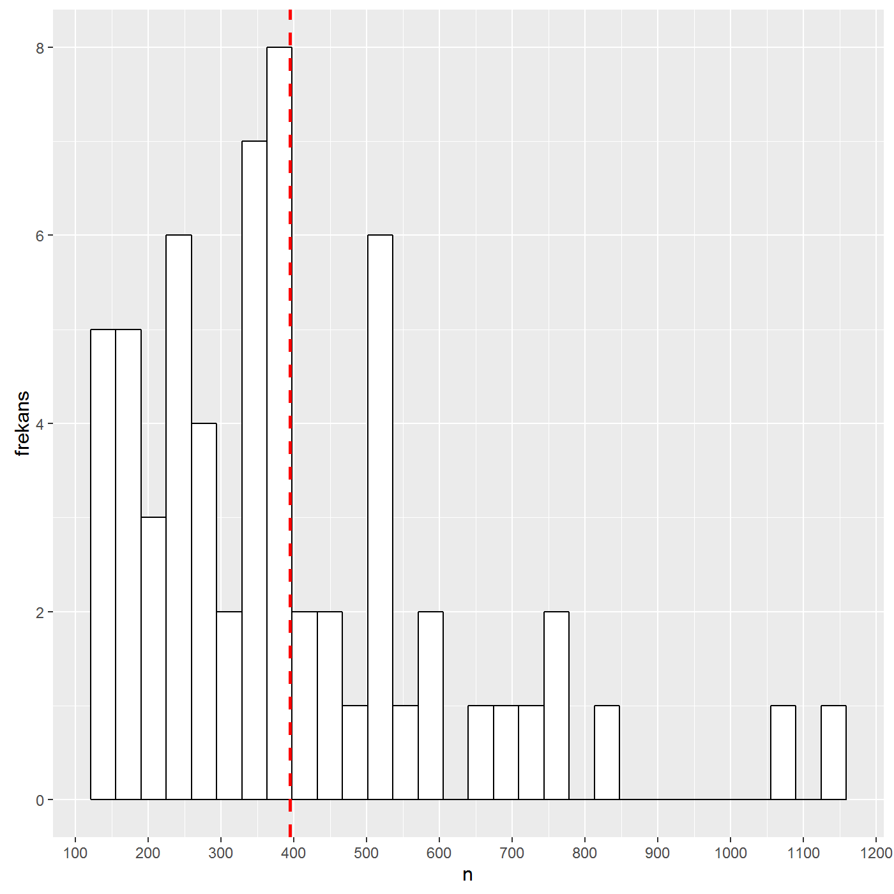

EPOD-2016

========================================================
author: Atılgan, H.,  Aydın, B.,  Gürel, S.,  Kaplan, M.
date: Eylül 2016

Faktör Analizi Kullanılan Yayınlamış Bilimsel Makalelerde Örneklem Özellikleri

Ana hatlar
===================================
* Amaç
* Yöntem
* Veri
* Sonuçlar
* Görev dağılımı

Amaç
========================================================

Kline (1994, s. 72) Faktör analiziyle elde edilen faktörler kullanılan örneklemden etkilenir. 

* Türkiye’de yayınlanan ve faktör analizi kullanılan bilimsel makalelerin örneklemleri özellikleri nelerdir?  

* Uygun örnekleme (convenience sampling) yönteminin kullanım sıklığı nedir?

* Kayıp  veri sorunu nasıl ele alınıyor?

Yöntem (2010 ve sonrası)
========================================================
* Eurasian Journal of Educational Research (EJER) 
* Hacettepe Üniversitesi Eğitim Fakültesi 
* Eğitim ve Bilim 
* _Kuram ve Uygulamada Eğitim Bilimleri (KUYEB)_

Veri
========================================================
* çalışmanın türü (ölçek uyarlama, ölçek geliştirme)
* faktör analizine taabi tutulan madde sayısı
* faktör analizi çerçevesi (doğrulayıcı ya da açımlayıcı)
* örnekleme yöntemi 
* örneklem büyüklüğü
* veri türü (kategorik, dereceleme)

***

* kullanılan kestirici 
* kullanılan yazılım
* kayıp veri yüzdesi
* popülasyon tanımın mevcut olup olmaması 
* alt faktör sayısı
* karşılaştırılan model sayısı.

Sonuçlar
==============================

Toplam 40 makale

***

25 Uyarlama,15 Geliştirme 

==============================

Ortalama $n_i$ =8.62

Analiz
=====================

32 AFA 26 DFA

***

YAZILIM

Örneklem
========================================================

(The Journal of Vocational Behavior, 2014, Ulakbim, 48)

***

Ortalama 394

Belirsizlikler 
========================================================

* Kayıp veri bilgisi (%80 yok)
* Tahminleyici (%66 yok)
* Popülasyon (%39 yok)
* Kıyaslama (%32 yok)

Model Uyum (26 DFA)
=============================
<table>
 <thead>
  <tr>
   <th style="text-align:left;">   </th>
   <th style="text-align:right;"> chi.df </th>
   <th style="text-align:right;"> RMSEA </th>
   <th style="text-align:right;"> SRMR </th>
   <th style="text-align:right;"> CFI </th>
   <th style="text-align:right;"> TLI </th>
   <th style="text-align:right;"> NFI </th>
   <th style="text-align:right;"> NNFI </th>
   <th style="text-align:right;"> GFI </th>
   <th style="text-align:right;"> AGFI </th>
  </tr>
 </thead>
<tbody>
  <tr>
   <td style="text-align:left;"> Min. </td>
   <td style="text-align:right;"> 1.51 </td>
   <td style="text-align:right;"> 0.04 </td>
   <td style="text-align:right;"> 0.01 </td>
   <td style="text-align:right;"> 0.85 </td>
   <td style="text-align:right;"> 0.94 </td>
   <td style="text-align:right;"> 0.85 </td>
   <td style="text-align:right;"> 0.83 </td>
   <td style="text-align:right;"> 0.83 </td>
   <td style="text-align:right;"> 0.78 </td>
  </tr>
  <tr>
   <td style="text-align:left;"> 1st Qu. </td>
   <td style="text-align:right;"> 2.04 </td>
   <td style="text-align:right;"> 0.06 </td>
   <td style="text-align:right;"> 0.05 </td>
   <td style="text-align:right;"> 0.95 </td>
   <td style="text-align:right;"> 0.94 </td>
   <td style="text-align:right;"> 0.92 </td>
   <td style="text-align:right;"> 0.95 </td>
   <td style="text-align:right;"> 0.90 </td>
   <td style="text-align:right;"> 0.87 </td>
  </tr>
  <tr>
   <td style="text-align:left;"> Median </td>
   <td style="text-align:right;"> 2.52 </td>
   <td style="text-align:right;"> 0.06 </td>
   <td style="text-align:right;"> 0.05 </td>
   <td style="text-align:right;"> 0.96 </td>
   <td style="text-align:right;"> 0.94 </td>
   <td style="text-align:right;"> 0.94 </td>
   <td style="text-align:right;"> 0.95 </td>
   <td style="text-align:right;"> 0.93 </td>
   <td style="text-align:right;"> 0.90 </td>
  </tr>
  <tr>
   <td style="text-align:left;"> Mean </td>
   <td style="text-align:right;"> 4.11 </td>
   <td style="text-align:right;"> 0.09 </td>
   <td style="text-align:right;"> 0.06 </td>
   <td style="text-align:right;"> 0.95 </td>
   <td style="text-align:right;"> 0.94 </td>
   <td style="text-align:right;"> 0.93 </td>
   <td style="text-align:right;"> 0.95 </td>
   <td style="text-align:right;"> 0.91 </td>
   <td style="text-align:right;"> 0.89 </td>
  </tr>
  <tr>
   <td style="text-align:left;"> 3rd Qu. </td>
   <td style="text-align:right;"> 2.98 </td>
   <td style="text-align:right;"> 0.08 </td>
   <td style="text-align:right;"> 0.06 </td>
   <td style="text-align:right;"> 0.97 </td>
   <td style="text-align:right;"> 0.95 </td>
   <td style="text-align:right;"> 0.95 </td>
   <td style="text-align:right;"> 0.97 </td>
   <td style="text-align:right;"> 0.95 </td>
   <td style="text-align:right;"> 0.92 </td>
  </tr>
  <tr>
   <td style="text-align:left;"> Max. </td>
   <td style="text-align:right;"> 34.22 </td>
   <td style="text-align:right;"> 0.55 </td>
   <td style="text-align:right;"> 0.11 </td>
   <td style="text-align:right;"> 0.99 </td>
   <td style="text-align:right;"> 0.95 </td>
   <td style="text-align:right;"> 0.98 </td>
   <td style="text-align:right;"> 0.99 </td>
   <td style="text-align:right;"> 0.96 </td>
   <td style="text-align:right;"> 0.93 </td>
  </tr>
  <tr>
   <td style="text-align:left;"> NA's </td>
   <td style="text-align:right;"> 5.00 </td>
   <td style="text-align:right;"> 2.00 </td>
   <td style="text-align:right;"> 6.00 </td>
   <td style="text-align:right;"> 2.00 </td>
   <td style="text-align:right;"> 24.00 </td>
   <td style="text-align:right;"> 9.00 </td>
   <td style="text-align:right;"> 13.00 </td>
   <td style="text-align:right;"> 9.00 </td>
   <td style="text-align:right;"> 12.00 </td>
  </tr>
</tbody>
</table>

KMO (32 AFA, min=.77, mean=.87, max=.96, na=7) 

Görev dağılımı
===========================
1) Örneklem türleri ve uygun örneklemin sakıncıları

2) Verinin tamamlanmasi ve açıklanması 

3) Faktör analizi kritikleri ve model uyumu

4) Tahminleyiciler ve kayıp veri teknikleri 

TEŞEKKÜRLER 
