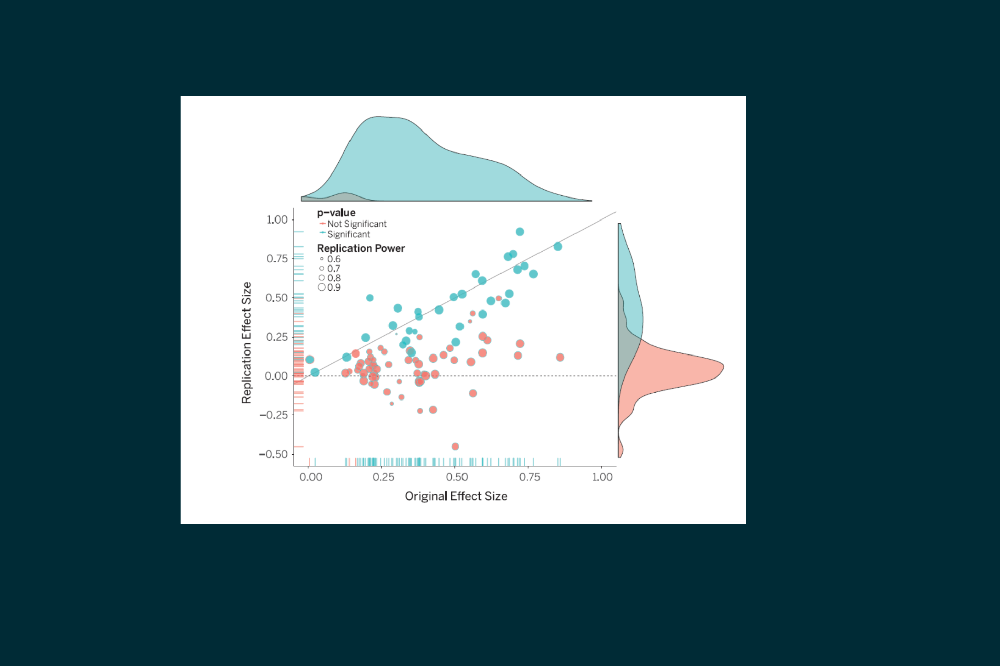
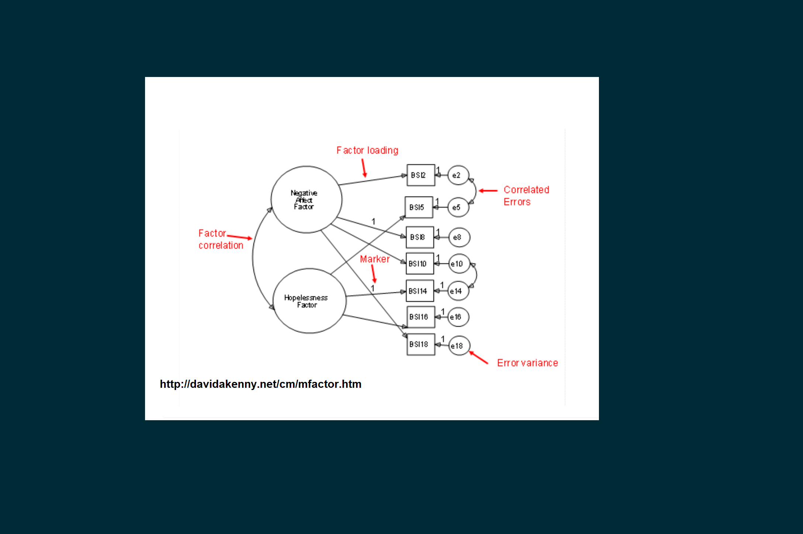

## SUNUMUN TEMEL REFERANSLARI

- [Aydın,Kaplan,Atılgan ve Gürel (2019)](https://dergipark.org.tr/en/pub/epod/issue/43953) 
- [Open Science Colloboration (2015)](https://science.sciencemag.org/content/349/6251/aac4716) 
- [Stevens (2017)](https://www.frontiersin.org/articles/10.3389/fpsyg.2017.00862/full) 

::: notes
- f fullscreen 
- o or ESC for overview mode
- alt and click an element to zoom
- s for speaker view
- B or . to pause the presentation
:::

## SUNUM İÇERİĞİ

- Tekrarlanabilirlik nedir?
- Faktör analizlerinde tekrarlanabilirlik
- Tekrarlanabilirlik için öneriler
- Soru-cevap

## TEKRARLANABİLİRLİK NEDİR? (Stevens,2018)

* Reproducibility, Replicability, Repeatability

  + Replicability - Farklı ekip, aynı tasarı, ayrı çalışma -> İlgililerin sonuçları/çıkarımları tekrarlama çabası?
  + Reproducibility - Farklı analist aynı çalışma -> İlgililerin bulguları/analizleri tekrarlama çabası? 

* Bu iki terim arasındaki çizgiyi belirlemek adına reproducibility -> computational reproducibility 

## OSC 2015 ne raporladı?

- 100 korelasyonel ve deneysel çalışmanın sonuçları sahada tekrarlanmaya çalışıldı.
- Yaklaşık %60'ı tekrarlanamadı.
-   

## SİZCE TEKRARLANABİLİRLİK KRİZİ VAR MI?

- Üç seçenekten birini kullanabilirsiniz

  + [Link](https://www.menti.com/wdwgzd68a1) 

  + www.menti.com adresinde  11 95 50 5 kodu

  + 

- [Sonuçlar](https://www.mentimeter.com/s/11e45937799118a1e4e8147fc1b8edf6/5ae788a2bf23)

## NATURE TEKRARLANABİLİRLİK ANKETİ

## FAKTÖR ANALİZİ 

- Ölçek geliştirme ve uyarlama
- Nicel araştırmalarda geçerlik ve güvenirlik kanıtı
- 

::: notes
Ölçek kullanımı ne kadar yaygın? %50
Göktaş, Karadağ, Sözbilir
FA yapı geçerliği için yeterli mi?
:::

## AYDIN, KAPLAN, ATILGAN & GÜREL (2019)

- Türkiye adresli dört saygın dergi
- 2010-2017 arası faktör analizi kullanan yayınlar
- 275 makale 448 analiz
- Faktör analizi sonuçlarını tekrarlayabilir miyiz?

## YANIT ARANAN SORULAR

- S1. Çalışmalarda evren tanımı ve örneklem seçimi
- S2. Örneklem büyüklüğü, soru ve faktör sayıları nelerdir?
- S3. Kayıp veriler nasıl ele alınmıştır?
- S4. Hangi yazılımlar kullanılmıştır?
- S5. Kullanılan veri türü (kategorik/sürekli) ve tahminleyiciler (estimator) nelerdir?
- S6. Rapor edilen uyum bilgileri nelerdir?

## S1-EVREN VE ÖRNEKLEM

- Net bir evren tanımı  %78 mevcut değil.
- Uygun örnekleme veya belirlenemeyen örnekleme oranı %51.
- Peki ne olmalı? Simon (1979) ve Gaskin, Orellana, Bowe ve Lambert (2017)

::: notes
Simon 1 üniversite 188, ulusal çapta 188.
Gaskin sağlık puanları çarpık ve normal
Aynı örneklemde AFA ve DFA Erkuş, 2016; Van Prooijen & Van Der Kloot, 2001
:::

## S2-ÖRNEKLEM BÜYÜKLÜĞÜ

- Ortanca örneklem büyüklüğü 380-460
- Ortanca faktör başına madde sayısı 7
- Ortanca madde başına örneklem 15

- Peki ne olmalı? Wolf, Harrington, Clark, & Miller, 2013

## S3-KAYIP VERİ

- %76 kayıp veri bilgisi mevcut değil.
- Bahsedenlerin %94'ü sıralı silme kullandığını raporlamış.
- Peki ne olmalı? 

::: notes
Boş bırakmamaya zorlamak? Xiao, Liu & Li 2017
:::

## S4-YAZILIM BİLGİSİ

- %34 yazılım bilgisi mevcut değil.
- Tamamı ticari yazılımlar, SPSS, AMOS ve Lisrel baskın
- Yazılım bilgisi neden önemli?

## S5-VERİ TÜRÜ VE TAHMİNLEYİCİLER

- %13 veri türü mevcut değil
- Mevcut olanların %98'si kategorik veri (en yaygın 5'li Likert)
- %93 tahminleyici bilgisi mevcut değil.
- Veri türü ve tahminleyici neden önemli? Li, 2016

::: notes
%69'u 5'li Likert sonra 3'lü Likert.
:::

## S6-UYUM

- RMSEA <0.06, SRMR <0.08, CFI, TLI(NNFI), NFI, GFI, AGFI için>0.95 kesme değerleri iyi uyumu işaret ediyorsa, incelenen çalışmaların yaklaşık yarısının bu kriterleri sağlamakta zorlandığı görülmüştür.

- Veri-model uyumu neden önemli?

::: notes
Ki-karenin serbestlik derecesine oranı ise değerlendirmede dikkate alınmamıştır
:::

## SONUÇ

- _İncelenen çalışmalarda raporlanan sonuçları tekrar edilebilmenin büyük oranda mümkün olmayacağı değerlendirilmiştir._

- Peki neden?

  + Bulguların tekrarlanabilirliği (computational rep.)
  + Sonuçların tekrarlanabilirliği (replicability)

::: notes
OSF benzeri Tubitak platformu
:::

## TEKRARLANABİLİR FAKTÖR ANALİZİ SONUÇLARI

- Muthen'in ölçek geliştirme basamakları 
- Örneklem seçimi?
- Katılımcı motivasyonu?
- Örnek araçlar <https://www.parinc.com/Products/PARiConnect>
- Şeffaflık

## TEŞEKKÜRLER

- Sorular?
- <https://www.aydinburak.net>
- Sunum RStudio paketi revealjs Hattab ve Allaire (2017)
 
