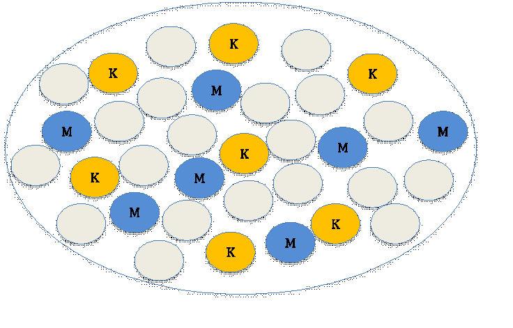
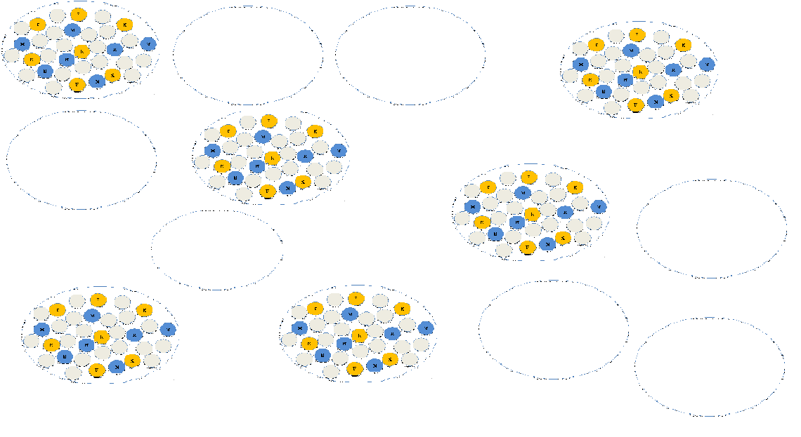
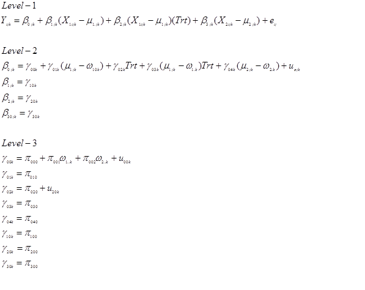
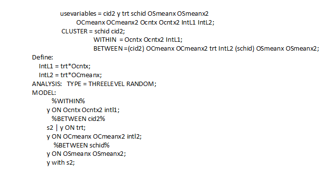
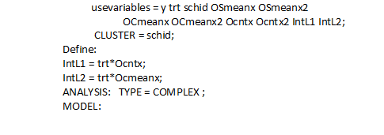
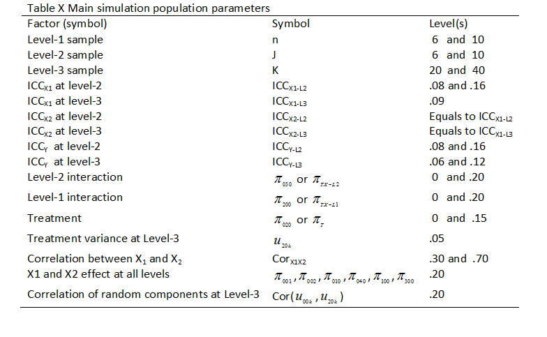
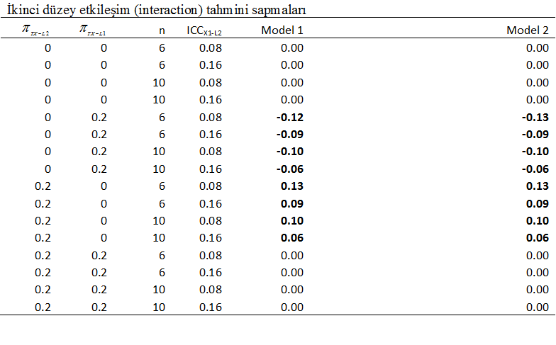
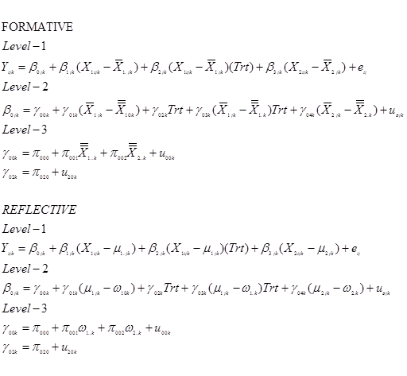

Ordu 2017
Kümelerin Seçkisiz Atandığı Çalışmalarda  Etki Heterojenliğinin İncelenmesi
========================================================
author:Burak AYDIN, James Algina, Walter Leite
date: May 2017
transition: concave

Sunumun Çerçevesi 
======================
1. Kümelerin seçkisiz atanması
2. Bölge-Küme ataması(multisite)
3. Model
4. Çözümleme Alternatifleri
5. Simulasyon
6. Sonuçlar
7. Tavsiyeler

Kümelerin seçkisiz atanması
=======================================

 Bölge-Küme ataması (multisite)
=======================================

Model
=====================

Çözümleme Alternatifleri-1 
=========================
Çok düzeyli model Mplus betik

Çözümleme Alternatifleri-2 
=========================
Tasarı odaklı model Mplus betik

Simulasyon
=====================

Sonuçlar
====================
1. Müdahele değişkeni ve birinci düzey etkileşim (interaction) için doğru tahminler, aynı istatistiksel güç ve birinci tip hata oranı 
2. 

Tavsiyeler (Simüle edilen şartlar için)
====================
 
1. Birinci ve ikinci düzeyde etkileşim farklı büyüklükte ise modeller ikinci düzey etkileşim için hatalı tahmin yapıyor.
2. Birinci ve ikinci düzeyde etkileşim benzer büyüklükte ise basit olan model kabul edilir sonuçlar veriyor

Sunum-2 
================================================================
1. ve 2. sunum ayrıdır.

Üç Düzeyli Modellerde Birinci Düzey Bağımsız Değişkenin Örtük Ortalamalarının Hesaplanması 
====================================================
Dr. Burak AYDIN

Sunumun Çerçevesi 
======================
1. Üç düzeyli modeller ve örnekler 
2. Oluşumsal (formative) ve Yansıtıcı (reflective) ortalamalar
3. Problem-Çözüm
4. Sonuçlar

Üç düzeyli modeller ve örnekler 
===============================

Oluşumsal (formative) ve Yansıtıcı (reflective) ortalamalar
================================

Problem ve Çözüm
================================

1. Problem: Yansıtıcı ortalamaların kullanılması gereken durumlarda, bir diğer ifade ile örnekleme dayalı hatanın  (sampling error) düzeltilmesi gerektiğinde, mevcut yazlımlar iki düzey için örtük ortalama hesaplayabilmelerine rağmen üçüncü (ve devamı) düzey için örtük ortalama hesaplamamaktadır.

2. Çözüm:  Croon & van Veldhoven (2007), Ludtke et al. (2008), Raudenbush & Bryk (2002) ve Shin & Raudenbush (2010) tarafından verilen iki düzeyde örtük ortalama hesaplanışlarını inceleyerek, üçüncü düzey için örtük ortalama hesaplamak.
 
 
Sonuçlar
==================== 
Tek tasarı 1000 replikasyon sonuçları

<small>

Referans
============================
Croon, M. A., & van Veldhoven, M. J. P. M. (2007). Predicting group-level outcome variables from variables measured at the individual level: A latent variable multilevel model. _Psychological Methods, 12_, 45-57. doi:10.1037/1082-989X.12.1.45

Ludtke, O., Marsh, H. W., Robitzsch, A., Trautwein, U., Asparouhov, T., & Muthen, B. (2008). The multilevel latent covariate model: A new, more reliable approach to group-level effects in contextual studies. _Psychological Methods, 13_, 203-229. doi:10.1037/a0012869

Raudenbush, S. W., & Bryk, A. S. (2002). _Hierarchical linear models: Applications and data analysis methods._ Thousand Oaks, CA: Sage

Shin, Y., & Raudenbush, S. W. (2010). A latent cluster-mean approach to the contextual effects model with missing data. _Journal of Educational and Behavioral Statistics, 35_(1), 26-53. doi:10.3102/1076998609345252

</small>
