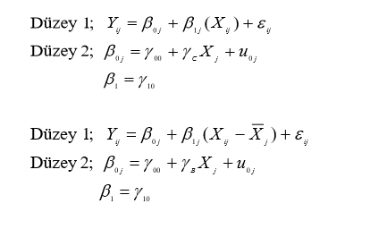

Çok Düzeyli Modeller - Tanıtım
========================================================
author: Burak AYDIN
date: 7 OCAK 2020
autosize: true

Nicel Veriler
========================================================

***

- Nicel veriler neden bu kadar hayatımızda ve önemli?

Galileo ve Galton
========================================================

***

Korelasyon 
========================================================

- $$\rho(x,y)$$

- $$cor(x,y)=\frac{\frac{\sum_{i=1}^n ((x_i - \hat{x})((y_i - \hat{y}))}{n-1}}{s_x s_y}$$

- Peki sadece iki değişkenin arasındaki doğrusal ilişkiyi anlamak yeterli mi?

Regresyon
========================================================

- $$Y_i=\beta_0 + \beta_1 X_{1i} + \beta_2 X_{2i} + e_i$$

- Ne kadar yaygın? 

- Sosyal bilimlerde ve eğitim araştırmalarında en çok atıf alan makaleler/araştırmacılar?

Regresyon örnekleri
========================================================

- Akademik başarıyı tahmin edebilir miyiz? 
- İlkokulda sınıf atlamanın akademik başarıda etkisi var mı? [1]
- İyi argüman geliştirmeyi etkileyen faktörler nelerdir? 

Regresyonda önemli noktalar 
========================================================

- Yordayıcı değişken seçimi
- Artıklar ve etkili gözlemler
- Doğrusal olmayan regresyon
- __Korelasyon gösteren veya bağımsız olmayan hata terimleri (BOHT)__

BOHT durumları
====================

1. Verilerin kümeli yapılardan gelmesi. Peki eğitim alanında hangi kümelerden bahsedebiliriz?

2. Boylamsal veriler. Peki boylamsal veriler neden önemlidir?

***

Çok düzeyli modellerin gerekliliği
========================================================

1. BOHT durumunda geçerli sonuçlara ulaşmak 
2. Bağlamsal etkileri görmek
3. Varyansın veya modelin düzeyler arası nasıl farklılık  gösterdiğini anlamak.

1. BOHT durumunda geçerli sonuçlara ulaşmak - örnek 
========================================================

- Kümelerden oluşan bir örneklemde müdahele etkisi araştırmak.

 

- Peki doğru tahmin yapmak için çok düzeyli modeller tek alterntif mi?

2. Bağlamsal etkileri görmek
========================================================

 

- Örnek: Büyük balık küçük göl etkisi [2]

3. Düzeyler arası varyans ve modeller
========================================================

- PISA başarısını etkileyen faktörler?

- Farklı düzeylerde farklı yapısal modeller

Nelere dikkat edilmeli?
========================================================

- Sabit ve rassal etkiler dikkatlice incelendi mi?

- Hata terimleri normal dağılım gösteriyor mu?

- Ortak etki veya doğrusal olmayan bağlantı var mı?

- Örneklem büyüklüğü yeterli mi? (İkinci düzey örneklemi azsa ne yapılabilir?)

- Ağırlıklandırma ?

- Sıradışı/etkili  gözlemler?

- Kayıp veriler?

Referanslar
========================================================

<small>

- [1] Kretschmann, J., Vock, M., & Lüdtke, O. (2014). Acceleration in elementary school: Using propensity score matching to estimate the effects on academic achievement. Journal of educational psychology, 106(4), 1080.

- [2] Marsh, H. W., Trautwein, U., Lüdtke, O., Baumert, J., & Köller, O. (2007). The big-fish-little-pond effect: Persistent negative effects of selective high schools on self-concept after graduation. American Educational Research Journal, 44(3), 631-669.

***

- Snijders ve Bosker (2012)
- Finch, Bolin ve Kelley (2014)
- Pinheiro ve Bates (2000)
- West, Welch ve Galecki (2015)

</small>

Soru-cevap 
========================================================

- Teşekkürler

