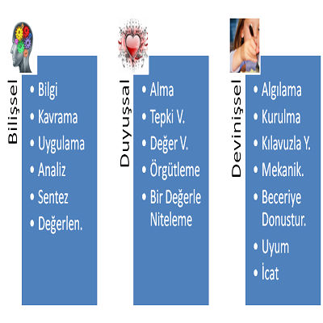
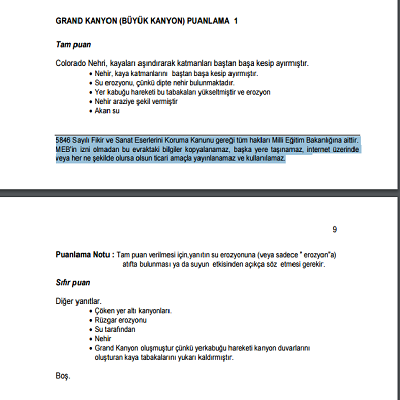

Kolokyum 2017
Kısa yanıtlı sorular
========================================================
author: Burak AYDIN 
date: Haziran 2017
transition: concave

Güvenirlik
========================================

***

ref: (Sijtsma,2009)

Geçerlik
================================================================

***

ref: (Doughty, 2006)

Kullanışlılık
================================================================

***

================================================================
KLASİK ÖLÇME ARAÇLARI

- Yazılı ve Sözlü
- **Kısa yanıtlı**
- Doğru-yanlış, eşleştirme, çoktan seçmeli

***

SINIFLAMA

- Nesnel veya öznel puanlama
- Yanıtı tanıma (recognition) veya üretme (recall)

Kısa yanıtlı sorular (KYS)
==============================

Kısa yanıtlı açık uçlu sorular öğrencilerin bir kelime, bir cümle, bir sembol veya matematiksel eşitlik gibi kısa bir yanıt vermeleri beklenen soru tipleridir. Kısa yanıtlı soruların yanıtı bir kelime, bir sembol, bir rakam, bir ifade ya da basit yapıda bir cümle (Atılgan, Kan, ve Aydın, 2017:167) olabileceği gibi bir cümle ile bir paragraf arasında da olabilir (Burrows, Gurevych ve Stein, 2015). 

KYS Örnekler
==============================

* Bir öğretmen yaptığı sınav sonrasında her öğrencinin puanına 10 puan eklemesi ne tür bir hatadır? “_______________” 

* Azotun periyodik cetveldeki sembolü nedir? “_______________” 

* 93’den küçük çift sayılar ile tek sayıların toplamı arasındaki fark kaçtır? “_______________”

KYS Örnekler-PISA 2015 (Üst düzey)
==============================

***

ref: http://pisa.meb.gov.tr

KYS Örnekler (Üst düzey)
==============================

***

ref: https://community.dur.ac.uk/smart.centre1/

KYS Örnekler - c rater(Üst düzey)
==============================

Liu, O. L., Brew, C., Blackmore, J., Gerard, L., Madhok, J., & Linn, M. C. (2014). “Automated scoring of constructed-response science items: Prospects and obstacles.” Educational Measurement: Issues and Practice, 33, 19–28.

KYS nerelerde kullanılıyor?
==============================
PISA, TIMMS, PIRLS, GRE, SAT, ÖSYM, Anadolu Üni., Sanal öğrenme ortamları

* Singapur ve Japonya örnekleri (Lam,2014: Naoki & Rie, 2016)

KYS neden rağbette? 
==============================

* Üst düzey beceri?

Bir korelasyon katsayısı

I. İki değişken arasındaki ilişkiyi tanımlaya çalışır.  
II.  Bu katsayı sebep-sonuç belirtmez.  
III. Bu katsayı artı sonsuz ile eksi sonsuz arasında değer alabilir. 

Yukarıda yer alan cümlelerden hangisi ya da hangileri doğrudur?  

A) Yalnız I    B) Yalnız II     C) I ve II     D) I ve III    E) I, II ve III

* Şans başarısı, "test teknikleri", Sonuçsal geçerlik 

KYS mevcut durumu
==============================

* Puanlaması zor. 

* Maliyet 3000 kata kadar artabiliyor (Wainer & Thissen, 1993).

* 37 farklı yazılım , 1 Çince, 3 Almanca, 4 İspanyolca ve geri kalanı İngilizce (Burrows, Gurevych & Stein, 2015).

KYS robotik puanlama (c rater çalışma prensibi)
==============================

**1** Pilot çalışma (model kurma)

**Örnek** Aranan doğru konsept "Enerjinin hayvanlara bitkilerden geçmesi."

Kabul edilebilecek cevaplar: 
 
Hayvanlar otları sindirerek enerji kazanır.

Bir hayvan ot yediğinde enerji alır.

Enerji otlardan hayvanlara transfer olur.

Ot yiyen hayvan enerji kazanır. 

ref: Liu ve diğ. 2014

==============================

**1** Pilot çalışma (model kurma)

İlk basamakta “cevapta olması gereken kelimeler” belirleniyor.  
 Yemek, sindirmek, enerji, hayvan, ot

Burada makinenin görevi cevapları bir elekten geçirmek, standardize etmek, benzer cümleleri bir araya toplamak. Yani cevapları organize edip puanlayıcıya sunmak. 

Modellenen cevaplarda olması gereken en önemli özellik: makine asıl sınav sonrası karşılaştığı yeni ama doğru cümleleri modellenen cevaplar ile eşleştirebilmeli. 

ref: Liu ve diğ. 2014

==============================

**2** Uygulama 

Öğrencilerden yanıtları alan makine öncelikle heceleme hatalarını düzeltir. 

Sonrasında ekleri ve kökleri ayırır. 

Eş anlamlı yada benzer kelime grupları oluşturur. 

**Örneğin** “Ormanda gezen canlılar yaprakları yiyerek enerji alır” cümlesi için bilgisayar yaprak-ot,  canlı-hayvan benzerliğini anlayabilir. Sonrasında 
“Ormanda gezen canlılar yaprakları yiyerek enerji alır”  cümlesini modellenen bir cümleye eşleyebilir,  örneğin “Bir hayvan ot yediğinde enerji alır” ve doğru puan verebilir.

ref: Liu ve diğ. 2014

==============================

**3**	Bilgisayara yardımcı olma aşaması 

Puanlayıcılar öğrencilerden gelen cevapları inceler ve gerekirse modellenen cümlelere yenisini ekler.

ref: Liu ve diğ. 2014

KYS araştırma konuları
==============================

* Hesaplanan puanların kusursuz olmasına yönelik  
* Sistemin suistimale karşı dirençli hale getirilmesine yönelik
* Soru yazımı ve model yanıtlar geliştirilmesine yönelik

 
