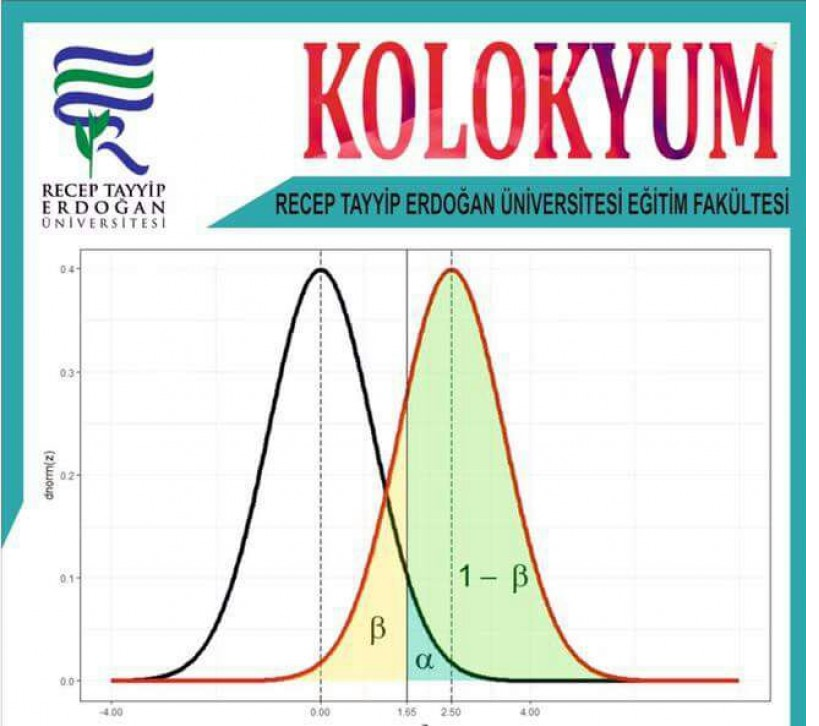
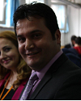

```{r setup, include=FALSE}
library(flexdashboard)
knitr::opts_chunk$set(fig.height =7)
```


Row
-------------------------------------
    
<table style="width:100%">
<tr>
  <td><center><h3>
  **Ölçme ve Değerlendirmede Yeni Eğilimler**
  </h3></center></td>
  <td rowspan="2">
  </img>
  </td>
</tr>
<tr><td><center><a
  title="RTE University"
  href="mailto:burak2358@gmail.com?Subject=Kolokyum17"
  target="_top">
  Recep Tayyip Erdoğan Üniversitesi Eğitim Fakültesi 
  </a></center></td>
</tr>
</table> 

<hr>

**Amaç :** Galileo 1638 yılında kaleme aldığı kitabının 88. sayfasında ışığın hızını nasıl ölçmeye çalıştığını anlatmıştır.Başarılı olamamıştır fakat ışığın çok hızlı olduğuna karar vermiştir. Daha sonra Raomer 1676 yılında Dünya-Güneş-Jüpiter geometrisini kullanmış  ışık hızını  214bin km/saniye olarak tahmin etmiştir. Bradley 1728 yılında yıldızlardan yola çıkarak 301bin km/sn, Fizeau 1849'da aynaları kullanarak 315bin km/sn, bu yöntemi geliştiren Foucault 298bin km/sn bulmuştur. Daha sonra insanoğlu magnetik alanları ve lazerleri kullanarak ışığın hızını 299,792.458 km/sn olarak kabul etmiştir. Fizikçiler ölçme araçlarını geliştirerek ışık hızını ölçmeyi başarmıştır. Peki insanoğlu öğrencilerin içindeki ışığı ölçmede ne zaman başarılı olacak? İşte bu kolokyumunun amacı ölçme ve değerlendirmenin bugününü ve yarınını konuşmaktır.

Konuşmacılar :

- Prof. Dr. Şener Büyüköztürk 

- Prof. Dr. Mehmet Küçük  

- Yar. Doç. Dr. Mehmet Kaplan

- Yar. Doç. Dr. Asiye Şengül Avşar 

- Yar. Doç. Dr. Fazilet Taşdemir 

- Dr. Burak AYDIN

Bu panel flexdashboard paketi kullanarak R ile hazırlanmıştır.

   
Row 
-------------------------------------
### **Prof. Dr. Şener Büyüköztürk** {data-height=800}
**Konuşmacı 1 Saat 11:00-12:00 **
</img>

**Tanınırlık**
[`Websitesi`](http://senerbuyukozturk.com.tr)

Google Akademik veritabanına göre yaklaşık 14000 atıfı olan Şener Hocamızın yayınlarından örnekler

- Bilimsel Araştırma Yöntemleri (Kitap)
- Sosyal Bilimler İçin Çok Değişkenli İstatistik (Kitap)
- TIMSS 2011 Matematik ve Fen Başarılarının İBBS-1 Düzeyinde İncelenmesi


**Konuşma Konusu**

Eklenecek

### **Prof. Dr. Mehmet Küçük** {data-height=800}
**Konuşmacı 2 Saat 10:15-11:00**
</img>

**Tanınırlık**
[`Websitesi`](https://kucukme.wordpress.com/)

Recep Tayyip Erdoğan Üniversitesi Eğitim Fakültesi Dekanı Mehmet Hocamınızın yayınlarından örnekler

- Eğitimde Ölçme ve Değerlendirme (Kitap)
- Fatih Projesi Kapsamında Pilot Uygulamanın Yapıldığı Bir Okulda Uygulama Sürecinin ve Çıktılarının Analizi
- 4 ve 5. Sınıf Öğrencilerinin Bilim İnsanı İmajlarının Karşılaştırılması


**Konuşma Konusu**

Eklenecek

### **Yar. Doç. Dr. Mehmet KAPLAN** {data-height=800}
**Konuşmacı 3 Saat 13:00-13:45**
</img>

**Tanınırlık**
[`Websitesi`](http://www.mhmtkpln.com/)

Şu an ÖSYM'de görev yapan Rutgers doktoralı Mehmet hocamızın yayın başlıkları

- Bilişsel tanı uygulamaları
- Nitelikli soru yazımı
- Bireye uyarlanmış sınavlar


**Konuşma Konusu**

Bilgisayar ortamında bireye uyarlanmış testler (BOBUT), teknolojinin de gelişmesiyle birlikte eğitimde ve psikolojide ölçme ve değerlendirme alanında kullanımı hızla artmıştır. BOBUT'un en önemli avantajlarından biri, bireylerin bir konudaki yetenek seviyeleri hakkında daha kısa test uzunluğu ile daha kesin ölçmeye olanak sağlamasıdır. Bu konuşmada BOBUT'un bileşenleri, kağıt-kalem testlerle avantajlarının karşılaştırılması ve olası yeni araştırma konuları hakkında kısa bir özet verilecektir.

Row 
-------------------------------------

### **Yar. Doç. Dr.Fazilet Taşdemir** {data-height=800}
**Konuşmacı 4 Saat 14:00 - 14:45**
</img>

**Tanınırlık**
[`Websitesi`](https://egitimetkinlikleri.wordpress.com/bolumlerimizden/egitim-bilimleri-bolumunden/fazilet-tasdemir/)


**Konuşma Konusu**

Yazılı sınavlar ve puanlanması


### **Yar. Doç. Dr. Asiye Şengül Avşar** {data-height=800}
**Konuşmacı 5 Saat 15:00-15:45**
</img>

**Tanınırlık**
[`Websitesi`](http://rteueod.wixsite.com/rteueod)


**Konuşma Konusu**

Eklenecek


### **Dr. Burak AYDIN** {data-height=800}
**Konuşmacı 6 Saat 16:00- 16:45**
</img>

**Tanınırlık**
[`Websitesi`](https://www.aydinburak.net/)

**Konuşma Konusu**

Neden Kısa yanıtlı soruların insansız/robotik puanlanması üzerine geliştirilmiş onlarca yazılım var ve yenileri sürekli geliştiriliyor? Geleceğin ölçme araçları kısa yanıtlı sorulara ne kadar yer verecek? PISA ve ÖSYM için bu tür sorular neden önemli? Akademisyenler ve öğretmenler için bu yeni gelişmeye yönelik araştırma konuları neler olabilir?


