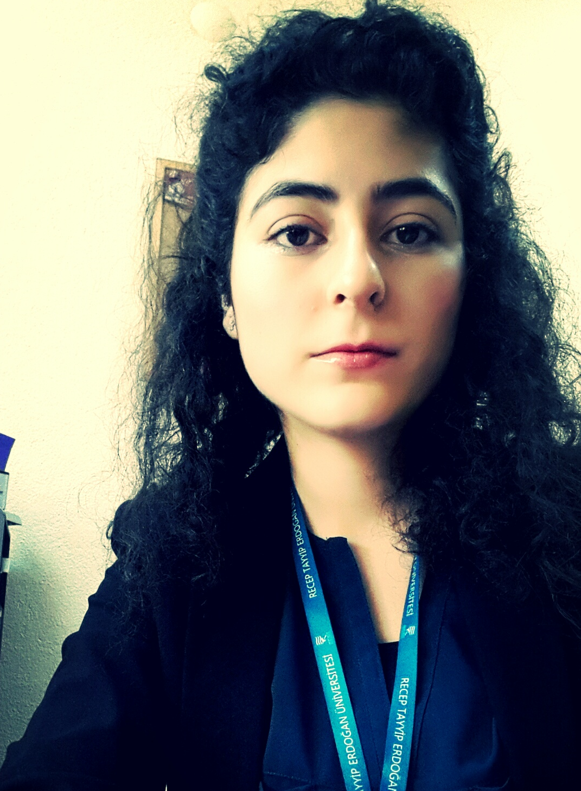
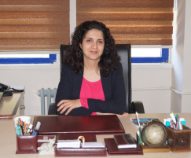
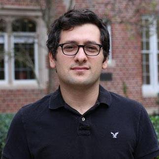

  **Ölçme ve Değerlendirmede Yeni Eğilimler**

**Yer** Recep Tayyip Erdoğan Üniversitesi Eğitim Fakültesi Konferans Salonu

**Tarih** 14 Haziran 2017 10:15 - 17:00

**Amaç :**  Eğitimde ölçme ve değerlendirmenin durumu ve aktif araştırma konuları hakkında bilgi paylaşımı.

**Konuşmacılar ve Kapsam:** 

- Açılış 10:15 - 11:00

- 11:00 - 12:00 Prof. Dr. Şener Büyüköztürk
"Okullarda Ölçme ve Değerlendirme: Hayallerimiz ve Gerçekler"

- 12:15 - 13:00  Yrd. Doç. Dr. Mehmet Kaplan 
"Bilgisayar ortamında bireye uyarlanmış testler"

- 13:15 - 14:00  Yrd. Doç. Dr. Asiye Şengül Avşar 
"ölçme kuramları ve duyuşsal özelliklerin ölçülmesi"

- 14:15 - 15:00  Yrd. Doç. Dr. Fazilet Taşdemir 
"Açık uçlu soruların yazımı ve puanlanması" 

- 15:15 - 16:00 Dr. Burak Aydın  
"Kısa yanıtlı soruların robotik puanlanması"

- 16:15 - 17:00 Dr. D. Bahar Şahin Sarkın
"Çoklu puanlanan ölçeklerde kesme puanının belirlenmesi"

Bu panel flexdashboard paketi kullanarak R ile hazırlanmıştır.

   
Row 
-------------------------------------
### **Prof. Dr. Şener Büyüköztürk** {data-height=800}
**Saat 11:00-12:00 **
</img>

**Tanınırlık**
[`Websitesi`](http://senerbuyukozturk.com.tr)

Google Akademik veritabanına göre yaklaşık 14000 atıfı olan Prof. Dr. Şener Büyüköztürk'ün yayınlarından örnekler;

- Bilimsel Araştırma Yöntemleri (Kitap)
- Sosyal Bilimler İçin Çok Değişkenli İstatistik (Kitap)
- TIMSS 2011 Matematik ve Fen Başarılarının İBBS-1 Düzeyinde İncelenmesi

**Konuşma Konusu**

Okullarda Ölçme ve Değerlendirme: Hayallerimiz ve Gerçekler

Okullarda ölçme ve değerlendirmenin temel odağı öğrenci performansıdır. Çocukların duygu durumlarını, gelişimlerini izlemek ve değerlendirmek ise malesef ikincil bir öneme sahiptir. Gözlenen o dur ki, ölçme ve değerlendirme genelde okul başarısıyla sınırlandırılmakta, gerçek hayat başarısını sorgulamaktan uzak kalmaktadır. Bu süreçte duyuşsal özellikler ise çoğu zaman ihmal edilmektedir. Çalışmalar, çocuklarımıza gerçek hayat başarısıyla milli ve insani değerleri kazandırmada başarısız olduğumuzu göstermektedir. Bu tablonun oluşmasında sınav odaklı eğitim sisteminin rolü nedir? Bu sonuçlar, okul bazında izleme ve değerlendirme süreç ve uygulamalarının hem anlayışta hem de içerikte dar bir alana sıkıştırılmasıyla açıklanabilir mi? 

### **Yrd. Doç. Dr. Mehmet Kaplan** {data-height=800}
**Saat 12:15-13:00**
</img>

**Tanınırlık**
[`Websitesi`](http://www.mhmtkpln.com/)

Şu an ÖSYM'de görev yapan Rutgers doktoralı Mehmet hocamızın yayın başlıkları

- Bilişsel tanı uygulamaları
- Nitelikli soru yazımı
- Bireye uyarlanmış sınavlar

**Konuşma Konusu**

Bilgisayar ortamında bireye uyarlanmış testler (BOBUT), teknolojinin de gelişmesiyle birlikte eğitimde ve psikolojide ölçme ve değerlendirme alanında kullanımı hızla artmıştır. BOBUT'un en önemli avantajlarından biri, bireylerin bir konudaki yetenek seviyeleri hakkında daha kısa test uzunluğu ile daha kesin ölçmeye olanak sağlamasıdır. Bu konuşmada BOBUT'un bileşenleri, kağıt-kalem testlerle avantajlarının karşılaştırılması ve olası yeni araştırma konuları hakkında kısa bir özet verilecektir.

### **Yrd. Doç. Dr. Asiye Şengül Avşar** {data-height=800}
**Saat 13:15-14:00**
</img>

**Tanınırlık**
[`Websitesi`](http://rteueod.wixsite.com/rteueod)

**Konuşma Konusu**

Eğitimde ve psikolojide bireyler hakkında önemli kararlar vermede kullanılan ölçme araçlarının psikometrik özelliklerinin araştırılması, ölçme ve değerlendirme uygulamalarında çok önemli bir yere sahiptir. Ölçme araçlarının psikometrik özellikleri çeşitli ölçme kuramlarına göre belirlenmektedir. Bu konuşmada ölçme kuramları tanıtılacak ve duyuşsal özelliklerin ölçülmesi üzerinde durulacaktır.

Row 
-------------------------------------

### **Yrd. Doç. Dr.Fazilet Taşdemir** {data-height=800}
**Saat 14:15 - 15:00**
</img>

**Tanınırlık**
[`Websitesi`](https://egitimetkinlikleri.wordpress.com/bolumlerimizden/egitim-bilimleri-bolumunden/fazilet-tasdemir/)

**Konuşma Konusu**

Üst düzey zihinsel becerilerin ortaya çıkarılması amacı ile kullanılan açık uçlu soruların kazanımlara uygun yazımı, soruların dereceli puanlama anahtarı (Rubrik) geliştirerek puanlanması, objektif ölçmeler için ölçme aracından ve ölçmeciden kaynaklanan hataların azaltılması ile ilgili bir paylaşımda bulunulacaktır.

### **Dr. Burak Aydın** {data-height=800}
**Saat 15:15- 16:00**
</img>

**Tanınırlık**
[`Websitesi`](https://www.aydinburak.net/)

**Konuşma Konusu**

Üst düzey davranışların ölçmesinin gerektiği durumlarda; kısa yanıtlı soruların etkin bir şekilde kullanılabilmesi, çoktan seçmeli sorularla üst düzey becerileri ölçmede karşılaşılan zorluklar ya da olanaksızlıkları aşmada yardımcı olabilir. Ancak özellikle geniş ölçekli sınavlarda üst düzey becerileri ölçmek için kullanılabilecek kısa yanıtlı soruların önemli bir sınırlılığı bulunmaktadır. Bu sınırlılık; kısa yanıtlı sınavların sorularına verilen yanıtların puanlanmasının uzman kişiler tarafından yapıldığında zaman ve emek bakımından ekonomik olmamasıdır. Söz konusu olan bu sınırlılık; kısa yanıtlı testlerin sorularının yanıt kümesinin sınırlı olması özelliğine dayalı olarak, sorularının puanlanmasında teknolojik gelişmelerin kullanılmasıyla ortadan kaldırılabilir. 

### **Dr. D. Bahar Şahin Sarkın** {data-height=800}
**Saat 16:15- 17:00**
</img>

**Tanınırlık**
[`Websitesi`](http://aves.erdogan.edu.tr/bahar.sahin/)

**Konuşma Konusu**

Çoklu puanlanan ölçeklerde kesme puanının belirlenmesi :Bireylerin çoklu puanlanan ölçeğin tepki düzeylerine göre sınıflandırılması ve yapılan sınıflandırmaların doğruluğunun sınanmaması tartışma konusu olarak belirlenmiştir. Farklı yöntemlerle ölçeklerin kesme puanı belirlenerek bireyleri sınıflandırma konusunda farklı bir bakış açısı sunulmaya çalışılacaktır.

